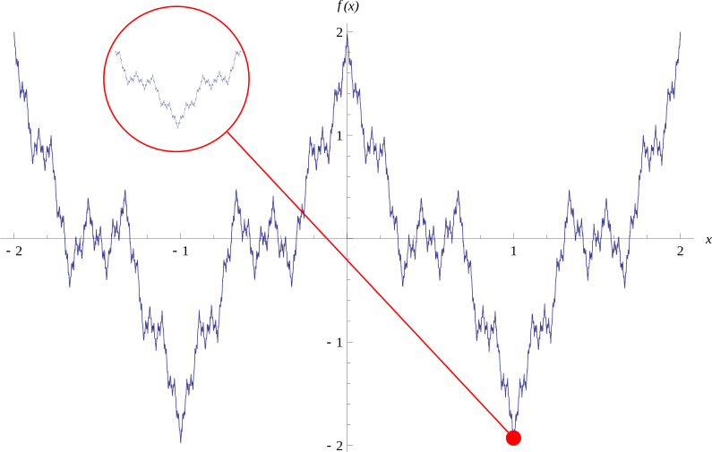
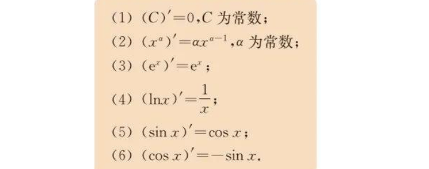
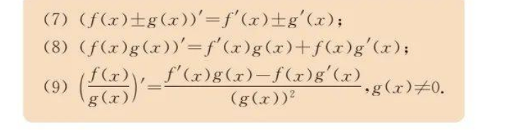

<!-- markdownlint-disable MD033 MD001-->

# 导数

<h2 style = "text-align : center;"> 所有教材概念 </h2>

<ul style="text-align: center; padding-left:0;list-style-type: none;" >
    <li>概念</li>
    <li>几何意义</li>
    <li>运算和基本公式</li>
    <li>复合函数求导</li>
    <li>应用</li>
</ul>

## 1. 导数的概念和意义 

### 1.1 定义

    定义：
   

<red>函数 $y = f(x)$ 在点 $x_0$ 处的导数值，定义为极限：</red>

$$f'(x_0) = \lim_{\Delta x \to 0} \frac{f(x_0 + \Delta x) - f(x_0)}{\Delta x}$$

    工程学定义：

<blue>$$ f(x_0+h) = f(x_0) + \textit{L}h + o(h) \approx f(x_0) + \textit{L} h x$$</blue>

<blue>其中 $\textit{L} = f'(x)$ 为导数值，$o(h)$ 表示当 $h \to 0$ 时，$o(h)$ 比 $h$ 快的无穷小。</blue>

<eg>思考</eg>
<comment style = "font-size: 1em">为什么要定义导数？</comment>
<comment style = "font-size: 1em">如果把函数与数列对应，一个函数的导数对应数列的什么成分？</comment>
<comment style = "font-size: 1em">导数存在的条件是什么？</comment>
<comment style = "font-size: 1em">导数值与自变量有关吗？</comment>

    小知识：

- **左导数**：$f'_-(x_0) = \lim_{\Delta x \to 0^-} \frac{f(x_0 + \Delta x) - f(x_0)}{\Delta x}$
- **右导数**：$f'_+(x_0) = \lim_{\Delta x \to 0^+} \frac{f(x_0 + \Delta x) - f(x_0)}{\Delta x}$
- Weierstrass函数 和 Cantor 函数：

$$f(x) = \sum_{n=0}^{\infty} a^n \cos(b^n \pi x)$$

### 1.2 几何意义

- **切线**：函数 $y = f(x)$ 在点 $x_0$ 处的切线方程为 $y = f(x_0) + f'(x_0)(x - x_0)$。

    小知识：

<blue>牛顿法（Newton's method）：$x_{n+1} = x_n - \frac{f(x_n)}{f'(x_n)}$</blue>

## 2. 导数的运算和基本公式

### 2.1 基本导数公式

<eg>例2.1.1</eg>
<comment style = "font-size: 1em">根据定义证明  $f(x) = x^2$ 的导数为 $f'(x) = 2x$； $f(x) = ln(x)$ 的导数为 $f'(x) = \frac{1}{x}$。</comment>

<eg>例2.1.2</eg>
<comment style = "font-size: 1em">求函数 $y = x^3 - 2x^2 + 3x - 4$ 的导数。</comment>

<eg>例2.1.3</eg>
<comment style = "font-size: 1em">求函数 $y = \frac{1}{x}$ 的导数。</comment>

### 2.2 导数的运算法则

- **和差法则**：$(u \pm v)' = u' \pm v'$
- **积法则**：$(uv)' = u'v + uv'$
- **商法则**：$\left(\frac{u}{v}\right)' = \frac{u'v - uv'}{v^2}$
- **复合函数求导**：$(f(g(x)))' = f'(g(x))g'(x)$

    小知识：

- **反函数求导**：$y = f^{-1}(x)$，则 $f'(f^{-1}(x)) = \frac{1}{f'(f^{-1}(x))}$
- **隐函数求导**：$F(x, y) = 0$，则 $\frac{dy}{dx} = -\frac{F_x}{F_y}$
- **参数方程求导**：$x = f(t), y = g(t)$，则 $\frac{dy}{dx} = \frac{g'(t)}{f'(t)}$
- **高阶导数**：$f^{(n)}(x)$ 表示 $f(x)$ 的 $n$ 阶导数
- **Leibniz公式**：$f^{(n)}(x) = \frac{d^n y}{dx^n}$
- **泰勒公式**：$f(x) = f(a) + f'(a)(x - a) + \frac{f''(a)}{2!}(x - a)^2 + \cdots$
- **L'Hospital法则**：$\lim_{x \to a} \frac{f(x)}{g(x)} = \lim_{x \to a} \frac{f'(x)}{g'(x)}$
- **微分**：$dy = f'(x)dx$
- **积分**：$\int f(x)dx = F(x) + C$
- **微分方程**：$y' + p(x)y = q(x)$

<eg>例2.2.1</eg>
<comment style = "font-size: 1em">证明复合函数求导公式。</comment>

<eg>例2.2.2</eg>
<comment style = "font-size: 1em">求函数 $y = (x^2 + 1)^3$ 的导数。</comment>

<!-- - $f(n) = O(g(n))$，表示存在常数 $C > 0$ 和 $n_0$，使得对所有 $n > n_0$，有 $|f(n)| \leq C|g(n)|$。
- $f(n) = o(g(n))$，表示对任意常数 $C > 0$，存在 $n_0$，使得对所有 $n > n_0$，有 $|f(n)| \leq C|g(n)|$。 -->

<!-- markdownlint-enable MD033 MD001-->

@import "../标准格式.md"

