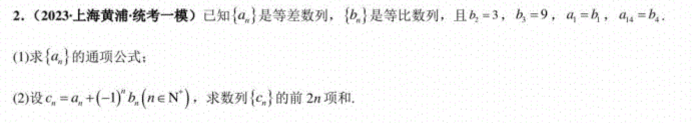
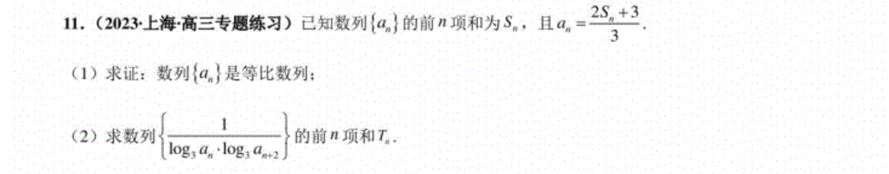
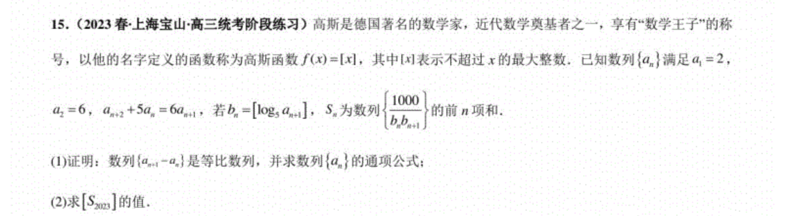
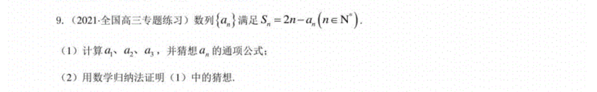

<!-- markdownlint-disable MD033 MD001-->

# 数列

<h2 style = "text-align : center;"> 所有教材概念 </h2>

<ul style="text-align: center; padding-left:0;list-style-type: none;" >
    <li>定义和性质</li>
    <li>等差数列</li>
    <li>等比数列</li>
    <li>斐波那切数列</li>
    <li>数学归纳法</li>
    <li>*迭代法求近似值</li>
</ul>

<h2 style = "text-align : center;"> *更多考试涉及内容 </h2>

<ul style="text-align: center; padding-left:0;list-style-type: none;" >
    <li>通项公式与递推关系</li>
    <li>极限（导数）</li>
    <li>特征根方程</li>
    <li>数列求和</li>
    <li>对新数列的分析运算</li>
</ul>

<h2 style = "page-break-before:always;"> 1. 数列的定义和性质 </h2>

### 1.1 数列的定义

    定义：
    
数列是按照一定的顺序排列的一列数，数列中的每一个数称为数列的项。

    严格定义：
    
数列是一个定义在正整数集合上的函数，即一个从正整数集合到实数集合的映射。

$$a: \mathbb{N} \rightarrow \mathbb{R}$$

数列的一般形式为：$a_1, a_2, a_3, \cdots, a_n, \cdots$，其中 $a_n$ 表示数列的第 $n$ 项，$\{a_n\}$ 表示该数列。

### 1.2 数列的性质

根据数列的定义，我们可以得到数列的一些重要性质：

- 数列是有序的，即数列中的每一个数都有一个确定的位置。
- *数列是无限的，即数列中的项的个数是无限的。
- *数列是可数的，即数列中的项可以一一对应到自然数集合中。

教材中的性质：

- 数列的项数是有限的或无限的。有限的数列称为有穷数列，无限的数列称为无穷数列。
- 每一项都大于（或小于）前一项的数列称为**递增（或递减）数列；严格大于（或小于）**前一项的数列称为**严格递增（或严格递减）数列**；统称为**单调数列**。
- 各项均相等的数列称为常数数列。

    实际上，数学上将无序数组定义为集合（set），将无限有序数组定义为数列（sequence），而将有限有序数组单独定义（Finite Finite Ordered Array），有时我们也称之为元组（Tuple），或者向量（Vector）。

    在计算机科学中，受限于存储空间，数组（Array）或元组（Tuple）是有序的有限的集合，但我们仍能通过递归的思想模拟无限数列。（如 Python 中 itertools 库。）

### 1.3 数列的表示方法

数列的一些常见表示方法：

- 通项公式：$a_n = f(n)$，其中 $f(n)$ 是 $n$ 的函数。
- 递推公式：$a_{n+1} = f(a_n)$，其中 $f(a_n)$ 是 $a_n$ 的函数。

<eg>思考</eg>
<comment style = "font-size: 1em">通项公式或递推公式唯一吗？一定存在吗？</comment>

数列的一些常见类型：

- **等差数列**：数列中相邻两项的差是一个常数。
- **等比数列**：数列中相邻两项的比是一个常数。
- **斐波那契数列**：数列中每一项都是前两项之和。

<eg> 例1.3.1 </eg> 

<comment>（$s,t,p,q$各不相同）<comment>

## 2. 数列的常见类型

### 2.1 等差数列

    定义：
    
如果一个数列中任意两项的差都是一个常数，那么这个数列就是等差数列。

等差数列的一般形式为：$a, a+d, a+2d, \cdots, a+nd, \cdots$，其中 $a$ 为**首项**，$d$ 为**公差**。

- **等差中项** $a_{\frac{m+n}{2}} = \frac{a_m + a_n}{2}$，其中 $m + 2= n$ 为任意整数。
- **递推公式**：$a_{n+1} = a_n + d$
- **通项公式**：$a_n = a + (n-1)d$
- **前 n 项和**：$S_n = \frac{n}{2}(a_1 + a_n) = \frac{n}{2}(2a + (n-1)d)$

<eg> 例2.1.1 </eg>

<!-- 14 -->

<eg> 例2.1.2 </eg>
<comment style ="font-size:0.8em;">已知等差数列$\{a_n\}$前 $n$ 项和为 $S_n$，$S_3 = 9$，$S_5 = 20$, $a_1 = 2$，求 $a_7$。</comment>

<!-- 15 -->

<eg>常用知识点</eg>
- $\{S_{(k+1)n}-S_{kn}\}$ 也是一个等差数列
- $S_n$ = $\frac{n}{2}(a_1 + a_n)$

### 2.2 等比数列

    定义：
    
如果一个数列中任意两项的比都是一个常数，那么这个数列就是等比数列。

等比数列的一般形式为：$a, aq, aq^2, \cdots, aq^n, \cdots$，其中 $a$ 为**首项**，$q$ 为**公比**。

- **递推公式**：$a_{n+1} = a_n \cdot q$
- **通项公式**：$a_n = a \cdot q^{n-1}$,<red>注意减一</red>
- **前 n 项和**：$S_n = \frac{a(1-q^n)}{1-q}$
- **无穷项和**：$S = \frac{a}{1-q}$，当 $|q| < 1$ 时成立。

<eg> 例2.2.1 </eg>

<!-- $4n^2 + \frac{9^n}{4} - \frac{1}{4}$ -->

<eg> 例2.2.2 </eg>

<!-- $2^n$ -->

<eg>例2.2.3</eg>

<!-- $3^n$ -->
<!-- $\frac{1}{2}(\frac{3}{2} - \frac{1}{n+1} - \frac{1}{n+2})$-->

<eg>例2.2.4</eg>

<!-- $5^{n-1} + 1$ -->
<!-- 999 -->

<eg>常用知识点</eg>

- 如何从递推公式或前 n 项和公式推导通项公式？

### 2.3 斐波那契数列

    定义：
    
斐波那契数列是一个数列，数列中每一项都是前两项之和。

斐波那契数列的一般形式为：$1, 1, 2, 3, 5, 8, 13, \cdots$。

- **递推公式**：$a_{n+2} = a_{n+1} + a_n$
- **通项公式**：$a_n = \frac{1}{\sqrt{5}}[(\frac{1+\sqrt{5}}{2})^n - (\frac{1-\sqrt{5}}{2})^n]$
- **前 n 项和**：$S_n = a_{n+2} - 1$

<eg> 思考 </eg>
<comment style = "font-size: 1em">斐波那契数列的通项公式如何推导？</comment>

## 3. 数学归纳法

### 3.1 数学归纳法的思想

- **首项成立**：证明当 $n = 1$ 时命题成立。
- **归纳假设**：假设当 $n = k$ 时命题成立。
- **归纳证明**：证明当 $n = k+1$ 时命题成立。

<eg>思考</eg>
<comment style = "font-size: 1em">还有其他类似的形式吗？</comment>

### 3.2 数学归纳法的应用

- 证明数列的性质

<eg>例3.2.1</eg>
<comment style = "font-size: 1em">证明立方数列的求和公式$S_n = \frac{n^2(n+1)^2}{4}$。</comment>

- 数论

<eg>例3.2.2</eg>
<comment style = "font-size: 1em">证明 $2^n > n^2$ 对所有 $n \geq 5$ 成立。</comment>

<eg>例3.2.3</eg>
<comment style = "font-size: 1em">证明 $7^n - 1$ 可以被6整除。</comment>

- 图论

<eg>例3.2.4</eg>
<comment style = "font-size: 1em">证明 $K_{2^n}$ 中有 $2^{n-1}$ 个边。</comment>

- 递归算法
- 组合数学

<eg>例3.2.5</eg>    
<comment style = "font-size: 1em">证明二项式定理$$(a+b)^n = \sum_{k=0}^{n} C_n^k a^{n-k}b^k$$</comment>

- 博弈论

<eg>例3.2.6</eg>
<comment style = "font-size: 1em"> Nim 游戏分析。</comment>

- 数据结构与算法

<eg>例3.2.9</eg>
<comment style = "font-size: 1em">证明快速排序的平均时间复杂度为 </comment> $O(n\log{n})$。

### 3.3 数学归纳法的例题

<eg>例3.3.1</eg>

<!-- $2^n - 1$ -->

<eg>例3.3.2</eg>

<!-- -->

## 数列极限

### 4.1 数列极限的定义

    定义：

<red class = "course">如果数列 $\{a_n\}$ 的项 $a_n$ 随着 $n$ 的增大趋于一个常数 $A$，那么称 $A$ 为数列 $\{a_n\}$ 的极限，记为 $\lim_{n \to \infty} a_n = A$。<red>

    严格定义：

<darkblue>若存在一个实数 $A$，对任意给定的正数 $\epsilon$ > 0，总存在一个正整数 N，使得当 $n > N$ 时，$|a_n - A| < \epsilon$，则称实数 $A$ 是数列 $\{a_n\}$ 的极限。</darkblue>

<darkblue>$$\forall  \varepsilon \in \mathbb{R},\varepsilon > 0, \exists N \in \mathbb{N}, \forall n > N, |a_n - A| < \varepsilon$$</darkblue>

<eg>思考</eg>
<comment style = "font-size: 1em">在有理数域上成立吗？在什么样的数域上能够成立</comment>

### 4.2 数列极限的性质

- 唯一
- 有界单调数列必有极限
- 数列极限的四则运算
- 夹逼定理

<eg>例4.2.1</eg>
<comment style = "font-size: 1em">证明数列$\{a_n\}$，$a_n = \frac{1}{n}$，有极限。</comment>

### 4.3常见的数列极限：

- $\lim_{n \to \infty} \frac{1}{n^p} = 0$，其中 $p > 0$。
- $\lim_{n \to \infty} \sqrt[n]{a} = 1$，其中 $a > 0$。
- $\lim_{n \to \infty} \frac{a^n}{n!} = 0$，其中 $a > 0$。
- $\lim_{n \to \infty} \frac{n!}{n^n} = 0$。

### 4.4 数列极限的计算

- 计算方法：凑+猜

<eg>例4.4.1</eg>
<comment style = "font-size: 1em">计算数列$\{a_n\}$，$a_n = \frac{n^2 + 1}{n^2 + 2}$的极限。</comment>

<eg>例4.4.2</eg>
<comment style = "font-size: 1em">计算数列$\{a_n\}$，$a_n = \frac{2n^2 + 3n + 1}{n^2 + 2n + 1}$的极限。</comment>

<eg>例4.4.3</eg>
<comment style = "font-size: 1em">计算数列$\{a_n\}$，$a_n = \frac{1}{n} + \frac{1}{n+1} + \cdots + \frac{1}{2n}$的极限。</comment>

<eg>常用知识点</eg>
- 数列的极限存在，数列和的极限就存在吗？
- 数列的极限不存在，数列和的极限就不存在吗？

    调和数列

    
<darkblue>调和数列是指数列$\{a_n\}$，$a_n = \frac{1}{n}$，调和数列的和是发散的。可被近似为 $\ln{m} + \gamma$, $\gamma = 0.57721$ 是欧拉-马歇罗尼常数（Euler-Mascheroni constant）。</darkblue>

### 4.5 函数极限与数列极限

    函数极限的严格定义：

<darkblue>设函数 $f(x)$ 在点 $x_0$ 的某个去心邻域内有定义，如果存在常数 $A$，对于任意给定的正数 $\varepsilon$，总存在正数 $\delta$，使得当 $0 < |x - x_0| < \delta$ 时，有 $|f(x) - A| < \varepsilon$，则称常数 $A$ 是函数 $f(x)$ 当 $x \to x_0$ 时的极限。</darkblue>

<darkblue>$$\forall  \varepsilon \in \mathbb{R},\varepsilon > 0, \exists \delta \in \mathbb{R}, \forall x, 0 < |x - x_0| < \delta, |f(x) - A| < \varepsilon$$</darkblue>

    与之等价，但从数列极限角度的定义：

<darkblue>设函数 $f(x)$ 在点 $x_0$ 的某个去心邻域内有定义，如果对于任意数列 $\{x_n\}$，当 $x_n \to x_0$ 时，有 $f(x_n) \to A$，则称常数 $A$ 是函数 $f(x)$ 当 $x \to x_0$ 时的极限。</darkblue>

<darkblue>$$\forall \{x_n\}, x_n \to x_0, f(x_n) \to A$$</darkblue> 

<eg>思考</eg>
<comment style = "font-size: 1em">函数极限与数列极限的关系是什么？</comment>

<!-- - $f(n) = O(g(n))$，表示存在常数 $C > 0$ 和 $n_0$，使得对所有 $n > n_0$，有 $|f(n)| \leq C|g(n)|$。
- $f(n) = o(g(n))$，表示对任意常数 $C > 0$，存在 $n_0$，使得对所有 $n > n_0$，有 $|f(n)| \leq C|g(n)|$。 -->

<!-- markdownlint-enable MD033 MD001-->

@import "../标准格式.md"

