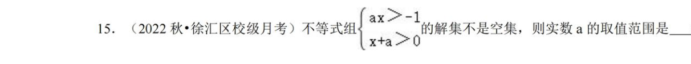
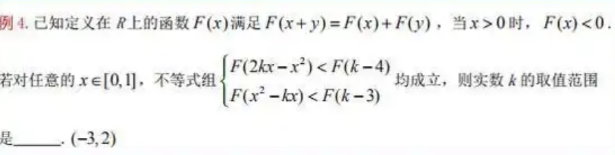

<!-- markdownlint-disable MD033 -->
<h1 style = "text-align: center !important;">复习小测1.10</h1>

## 集合，不等式，函数

**1.1** 

<ul class = "optionsr">
    <li>A. 44</li>
    <li>2. 143</li>
    <li>3. 100</li>
    <li>4. 0</li>
</ul>

<!--143-->

**1.2** 

<!-- $(-1, + \inf)$-->

**1.3** 

<!-- $(-2,3)$-->

**1.4** 

a足够大

<!-- 4016-->

**1.5** 
证明即可

**思考题**

题目：

1. *有理数多还是无理数多？
2. 为什么实数集比有理数集更密集？（思考一下即可，启发数学兴趣）

*提示1：在没有定义数的情况下，人们通过一一对应的方法比较有限个个体的数量，这种方法叫做**对等原理**。比如，如果想比较一盘梨和一盆苹果的多少，可分别取出一只梨和一只苹果放在一起，如果最后有苹果或梨多出来，就说明多的那种水果多这种方法也可以用来比较有限个数的无理数和有理数的多少。*

实质上这时我们建立了一个从苹果到梨的一一对应关系：

$$ f: \text{盘子内的苹果} \to \text{盆子内的梨}, f(某特定苹果) = 某特定梨$$

这种一一对应关系的存在说明了两个集合的元素个数相等或不等。

同样的，我们可以通过证明在有理数和无理数之间无法建立一一对应关系，从而证明无理数比有理数多。比较麻烦，感兴趣的话可以参考康托尔对角线法则（Cantor’s diagonal argument），无穷酒店问题等。

提示2：(i) 每个有理数的周边无限小处都有有理数吗，实数呢？(ii) 有理数列的极限一定是有理数吗，实数呢？试构造一个有理数列，使其极限是无理数。（iii）一个度量空间中是否像实数这样密集，取决于什么？可以给出比数列极限存在更弱的要求吗？

<!-- markdownlint-enable MD033 -->

@import "../../styles/format.html"
@import "../../styles/blank.html"
