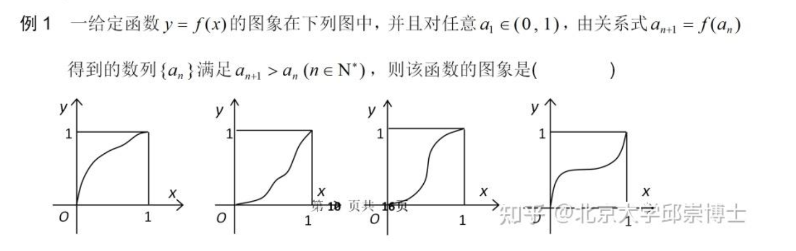

<!-- markdownlint-disable MD033 -->
<h1 style = "text-align: center !important;">数列小练习</h1>

**练1** 

**练2** 

**练3** 

**练4** 

<!--(1) $$\frac{3n-2}{2n-1}$$ -->
<!--(2) $$m=3,n=8$$ -->

<!-- markdownlint-enable MD033 -->

@import "../../styles/format.html"
@import "../../styles/blank.html"

