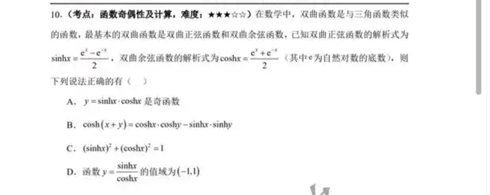
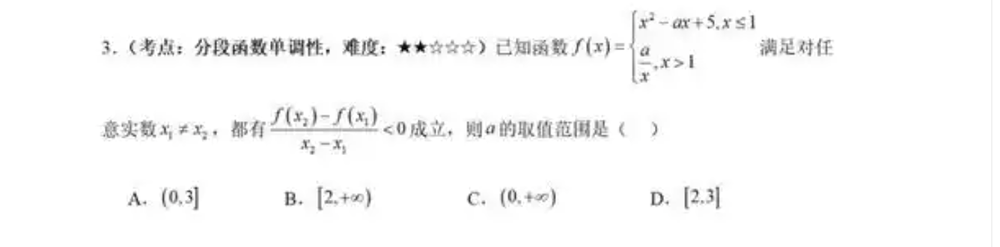
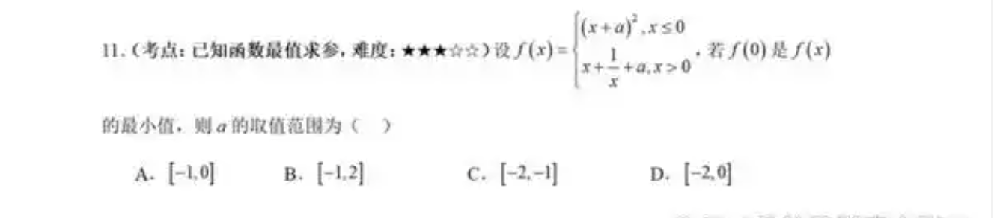
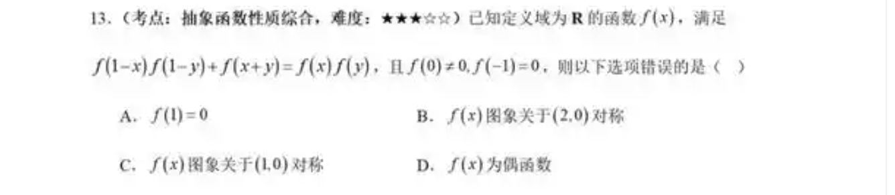
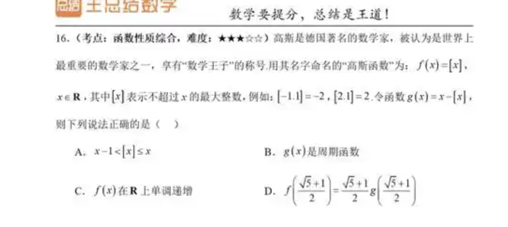

# 函数强化练习

## 概念复习

**定义** 非空数实数集与实数集部分的映射称为函数。称对应关系为函数f，记作y=f(x)。其中x称为自变量，y称为因变量。

定义域：自变量的取值范围(domain)

值域：因变量的取值范围$\{y|y=f(x),x \in D\}$(range)

(codomain)值域的界

**解析法** 通过解析式来定义函数，类似还有列表法

**性质** 函数的性质有：奇偶性、周期性、单调性、有界性、最值、零点、渐近线、连续性、可导性、凹凸性、极值、拐点、渐近线等。

### 函数的定义

