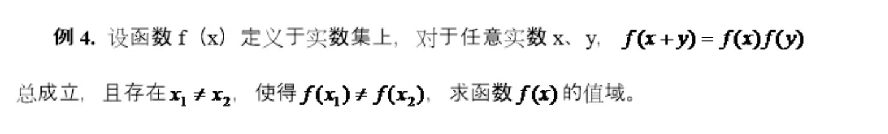
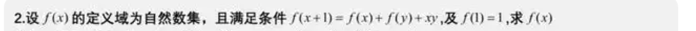
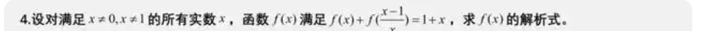
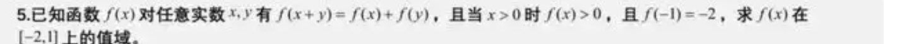

# 函数练习 1.19

## 函数图像

1. 画出下列函数的图像

- $y = x^3$
- $y = x^{-2}$
- $y = \sqrt{x}$
- $y = \sqrt[3]{x}$
- $y = \frac{1}{x}$
- $y = \frac{1}{x-1}+4$
- $y = \frac{5x^2+4}{x^2+1}$
- $y = 2^x$
- $y = 0.5^x$
- $y = \log_{2}x$
- $y = \log_{0.5} x$
- $y = e^x$
- $y = cosh(x) = \frac{e^x+e^{-x}}{2}$
- $y = sin(x)$
- $y = tan(x)$
- $y = cot(x)$
- $y = sec(x)$
- $y = csc(x)$
- 摆线 $x = a(t - \sin t)$, $y = a(1 - \cos t)$

2. 画出下复合函数的图像

- $y = \sqrt{1-x^2} + 2$
- $y = \ln(x^2+1)$
- $y = \frac{1}{\sqrt{1+x^2}}$
- $y = \frac{1}{\sqrt{1-x^2}}$
- $ y = \lfloor x \rfloor $
- $ y = \lceil x \rceil $
- $ y = \{ x \} $
- $ y =  \lfloor x^2 \rfloor$
- $ y = \lceil x \rceil + \{ x \} $

## 抽象函数

