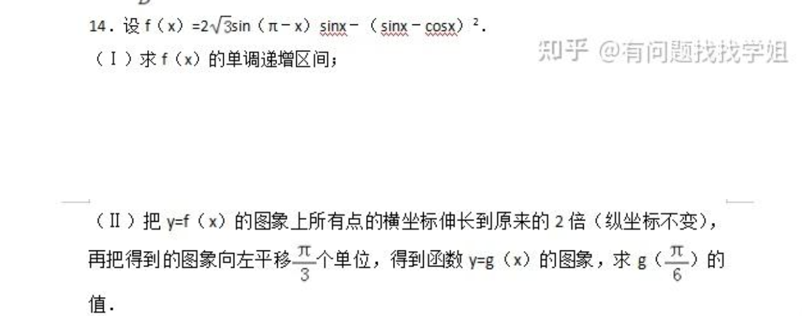
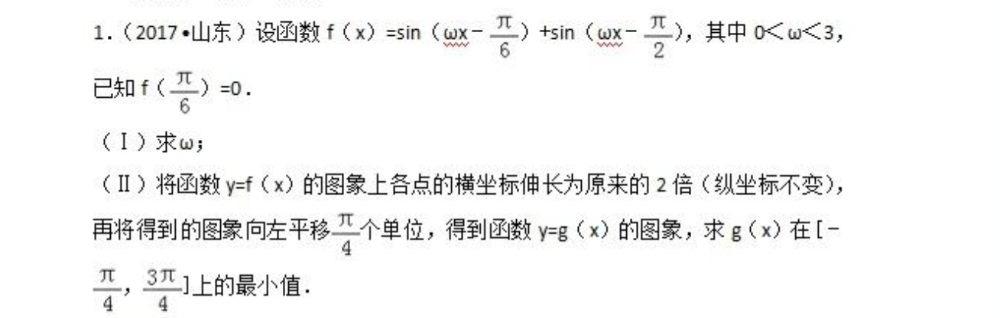
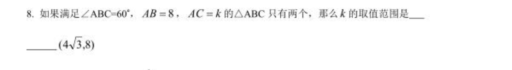
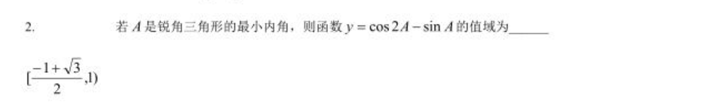
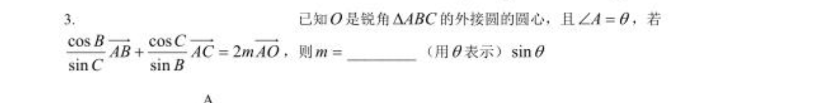

# 三角函数

## 概念

1. 直角三角形定义

2. 单位圆定义

3. 性质：

- 周期性
- 奇偶性
- 定义域和值域

## 图像

## 基本公式

- $\sin^2x+\cos^2x=1$

- $\tan x=\frac{\sin x}{\cos x}$

- $\cot x=\frac{1}{\tan x}$

- $\sec x=\frac{1}{\cos x}$

- $\csc x=\frac{1}{\sin x}$

## 公式

1.和角公式 

$ \sin(a \pm b) = \sin a \cos b \pm \cos a \sin b $

$ \cos(a \pm b) = \cos a \cos b \mp \sin a \sin b $

$ \tan(a \pm b) = \frac{\tan a \pm \tan b}{1 \mp \tan a \tan b} $

3.倍角公式 

<red>$ \sin 2a = 2 \sin a \cos a $ </red>

<red>$ \cos 2a = \cos^2 a - \sin^2 a = 2 \cos^2 a - 1 = 1 - 2 \sin^2 a $ </red>
    
$ \tan 2a = \frac{2 \tan a}{1 - \tan^2 a} $

4.半角公式 

<red>$ \sin \frac{a}{2} = \pm \sqrt{\frac{1 - \cos a}{2}} $ </red>

$ \cos \frac{a}{2} = \pm \sqrt{\frac{1 + \cos a}{2}} $

$ \tan \frac{a}{2} = \pm \sqrt{\frac{1 - \cos a}{1 + \cos a}} $

5.积化和差 

<red>$ \sin a \sin b = \frac{1}{2}[\cos(a - b) - \cos(a + b)] $ </red>

$ \cos a \cos b = \frac{1}{2}[\cos(a - b) + \cos(a + b)] $

$ \sin a \cos b = \frac{1}{2}[\sin(a + b) + \sin(a - b)] $

6.和差化积

$ \sin a + \sin b = 2 \sin \frac{a + b}{2} \cos \frac{a - b}{2} $

$ \sin a - \sin b = 2 \cos \frac{a + b}{2} \sin \frac{a - b}{2} $

$ \cos a + \cos b = 2 \cos \frac{a + b}{2} \cos \frac{a - b}{2} $

$ \cos a - \cos b = -2 \sin \frac{a + b}{2} \sin \frac{a - b}{2} $

7.万能公式 

<red>$ \sin(a) =\frac{\tan(\frac{a}{2})} { 1 + \tan^2(\frac{a}{2})} $ </red>

$ \cos(a) =\frac{1} { 1 + \tan^2(\frac{a}{2})} $

<red>$ \tan(a) =\frac{2\tan(\frac{a}{2})} { 1 - \tan^2(\frac{a}{2})} $ </red>

## 例题

