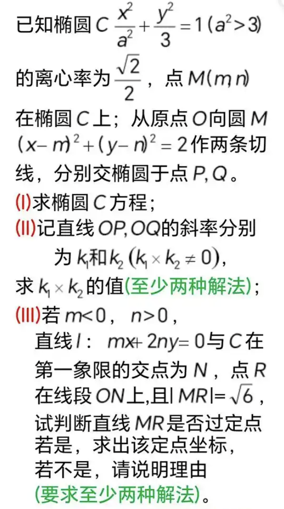
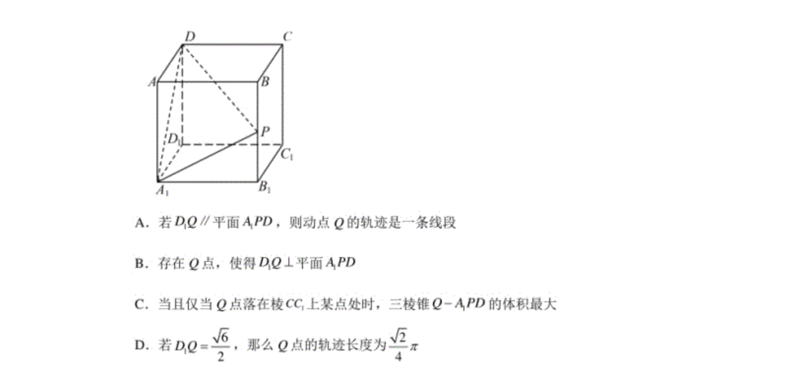
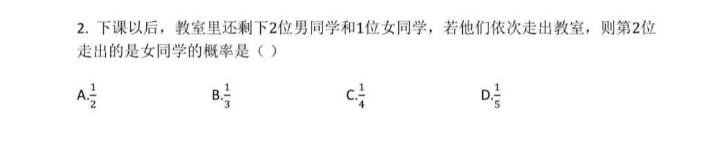
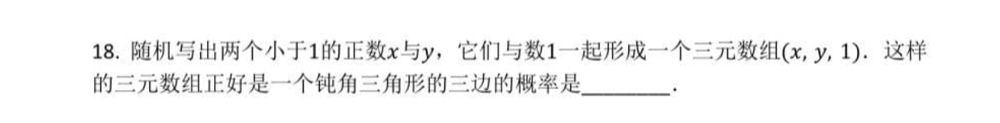

# 1.3 期末复习

## 解析几何

### 直线

- 两直线夹角
- 点到直线距离
- 垂直与k

### 切线

- 切线方程
- 切点弦
- 离心率

### 椭圆

- 焦点三角形面积
  $S = b^2\tan{\frac{\theta}{2}}$

- 焦点三角形周长
- 蒙日圆
- 光学性质
- 焦点三角形内切圆

**例 t1** 

### 双曲线

- 性质
- 渐近线
- 定义域

**例 s1** 

**例 s2** 

### 其他

- （纺射变换）

**例 q1** 

## 立体几何

**例 l1** 

**例 l2** 

- 正弦定理
- 余弦定理

## 概率统计

**例 g1** 

**例 g2** 

**例 g3** 

**例 g4** 
