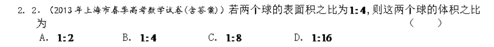
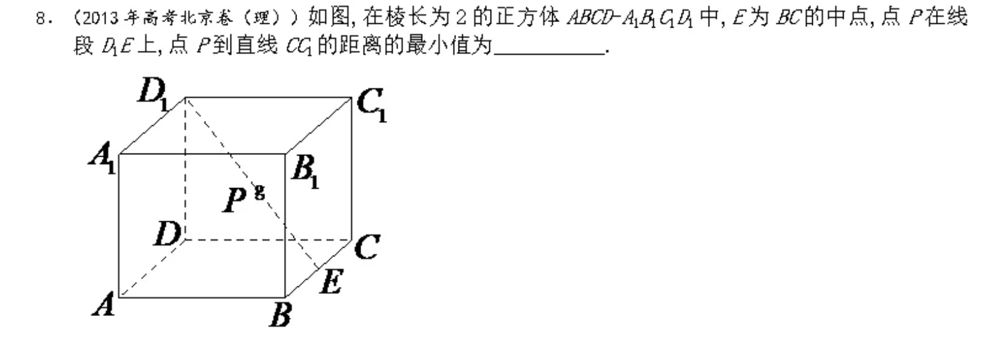
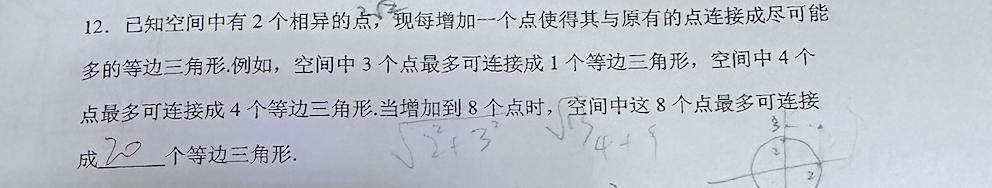

# 12.31课后作业

**Q1** 

**Q2** 

**Q3** (知乎)

**Q4** (2024嘉定二模)
*提示：用$(x_1,y_1)$, $(x_2,y_2)$，分别表示A和B的坐标，用求根公式解$x_1x_2$和$x_1+x_2$的值。*

**思考题** 

*不需要严格的证明，最好能跟家人讨论讨论，或者空闲的时候想一想。*
已知8个节点最多产生20个等边三角形。

1. 此时形状是什么？（画出形状即可，无需数个数，下同）
2. 如果题目要求的不是等边三角形的个数，而是等边多边形的个数，结论会改变吗？
3. 当有5个节点时，形状是什么？试用此解释$IO_5^-$（五氧阴离子，碘为+7价）的形状。
4. 当有6个节点时，形状是什么？为什么这时的形状与$SF_6$不同？
