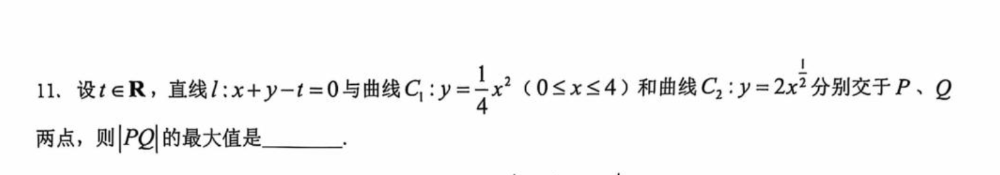
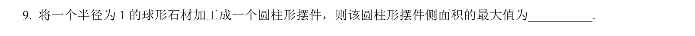
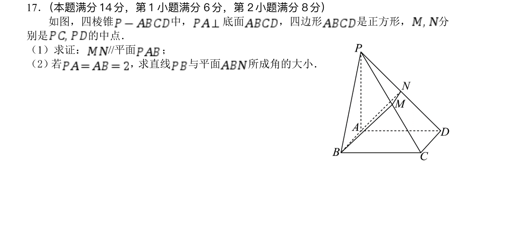
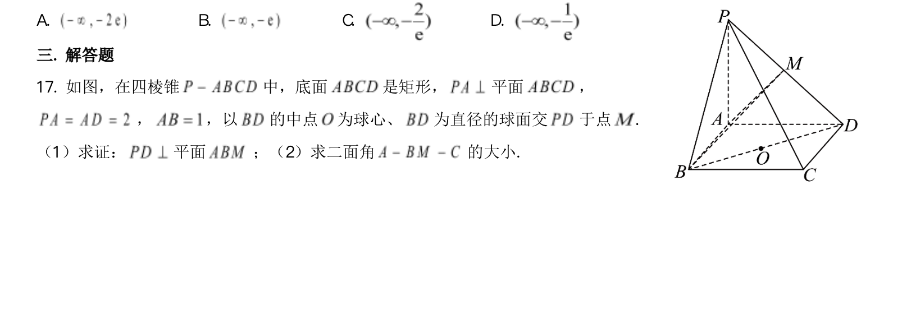

# Midterm Review

## 填选题

### Q1 普陀

### Q2 普陀

### Q3 普陀

### Q4 杨浦

### Q5 宝山

### Q6 宝山

### Q7 闵行

### Q8 长宁（这个题出的不太好，思考一下即可）

### Q9 虹口

### Q10 虹口

### Q11 虹口

## 大题

### DQ1 通河中学

### DQ2 

